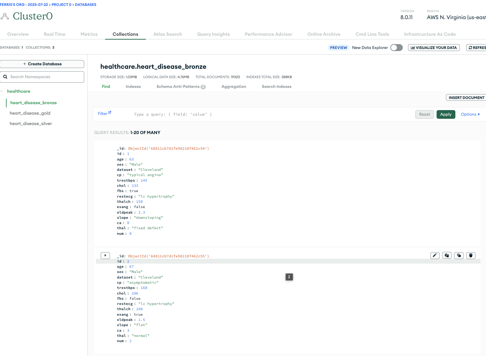
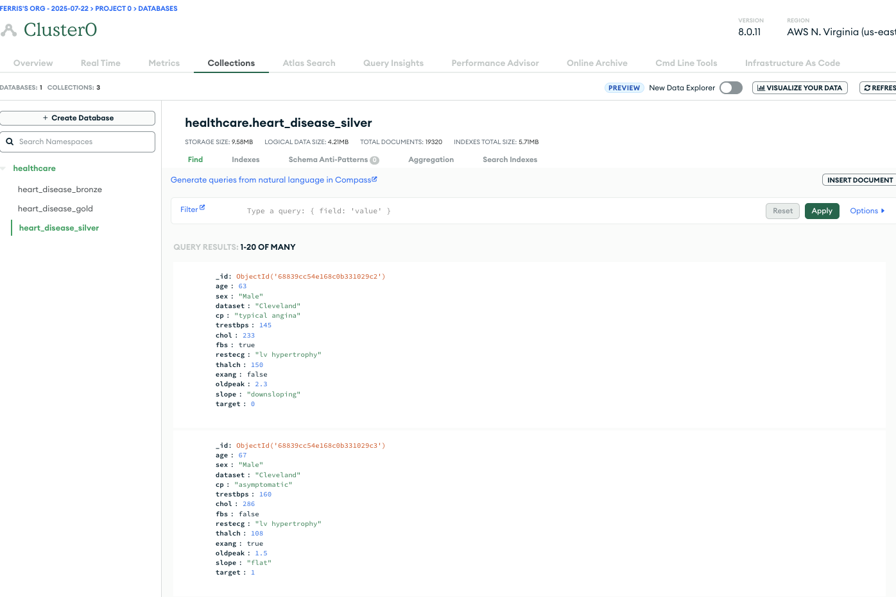
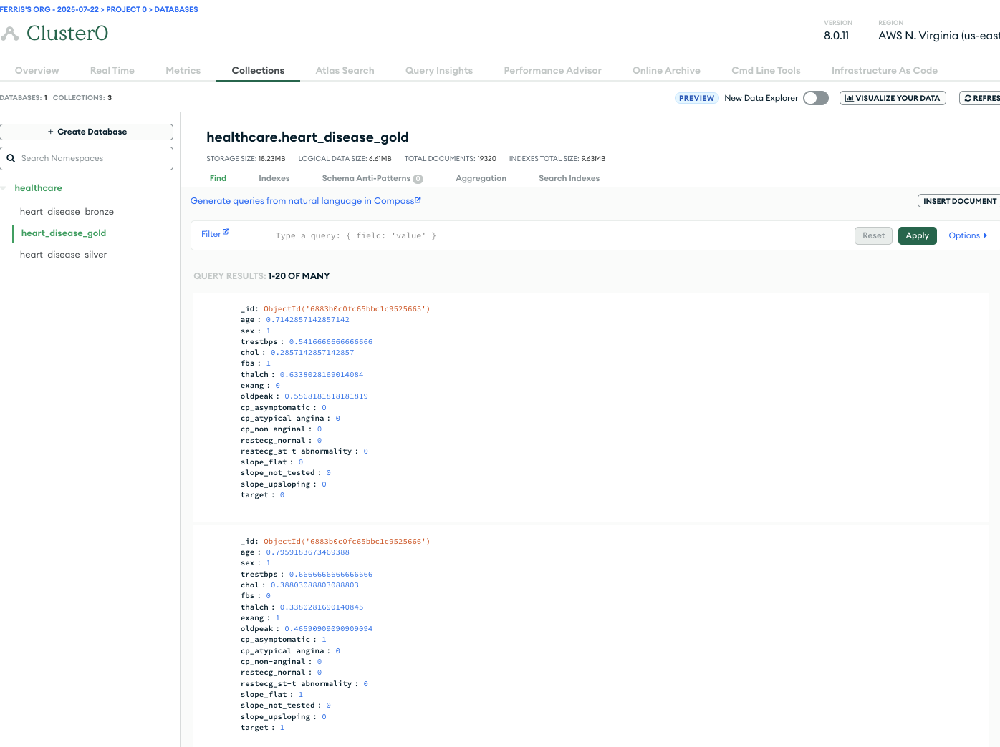
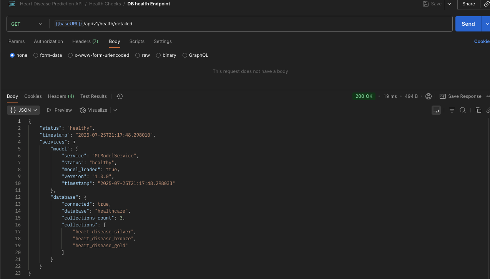
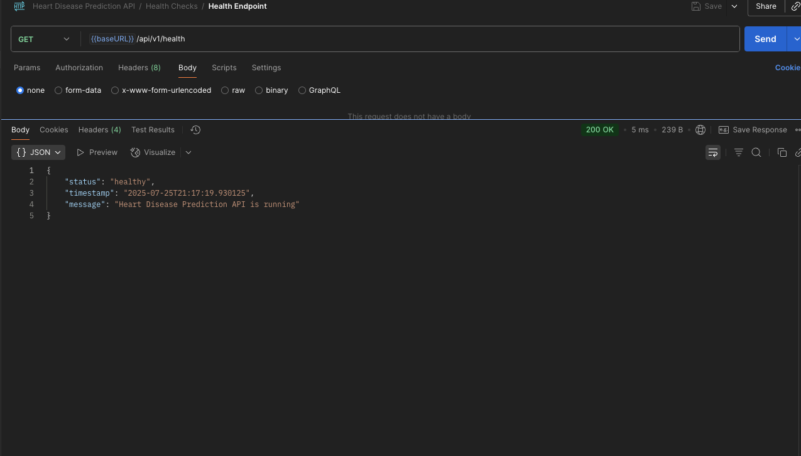
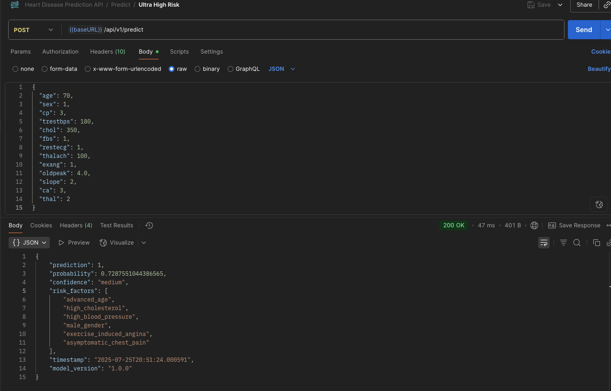
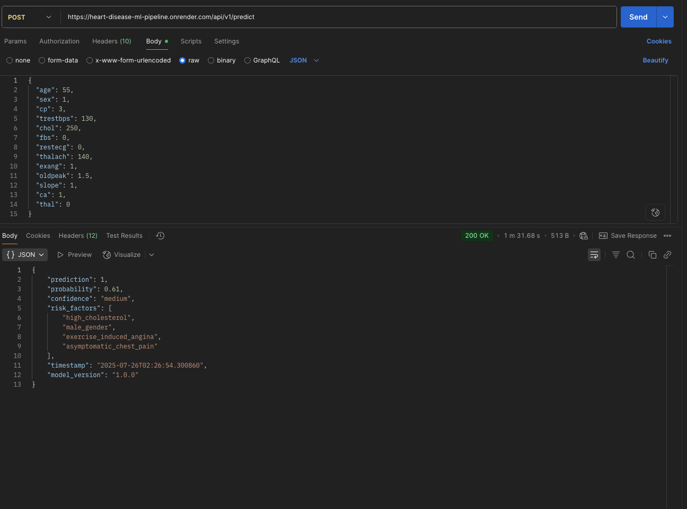

# Heart Disease ML Pipeline

A machine learning pipeline for heart disease prediction using medallion architecture (Bronze, Silver, Gold layers) with MongoDB and FastAPI.

## Prerequisites

- Python >= 3.10.12
- MongoDB
- FastAPI
- Motor
- Pydantic
- Scikit-learn
- XGBoost
- Joblib
- PyMongo
- Python-dotenv
- Matplotlib
- Seaborn
- Jupyter
- Loguru
- Pytest
- Httpx
- IPython

## Project Structure

```
heart-disease-ml-pipeline/
├── api/                    # FastAPI application
├── notebooks/              # Jupyter notebooks for ML pipeline
├── models/                 # Saved ML models
├── data/                   # Dataset storage
├── src/                    # Shared utilities
├── tests/                  # Test files
├── docs/                   # Documentation
├── deployment/             # Deployment configuration
└── scripts/                # Utility scripts
```
# Screenshots

## MongoDB Data Layers

### Bronze Layer (Raw Data)


### Silver Layer (Cleaned Data)


### Gold Layer (Feature-Engineered Data)


## API Testing with Postman

### Health Check Endpoint


### Overall Health Endpoint


### Prediction Endpoint


### Prediction Endpoint


## Local Development with Docker Compose

For a full-featured local dev environment (API, MongoDB, Jupyter, etc), use the provided helper script:

```bash
./devel/local_run.sh start      # Start all services (API, DB, Jupyter)
./devel/local_run.sh stop       # Stop all services
./devel/local_run.sh restart    # Restart services
./devel/local_run.sh logs       # Show logs
./devel/local_run.sh status     # Show container status
./devel/local_run.sh test       # Run health checks
./devel/local_run.sh clean      # Remove all containers/volumes
./devel/local_run.sh help       # Show all commands
```

- Jupyter: http://localhost:8888
- API Docs: http://localhost:8000/docs
- MongoDB: localhost:27017 (see .env for credentials)

**.env**: The script will auto-generate .env from .env.example if missing.

---
## Quick Start

1. **Clone and setup environment**
   ```bash
      git clone https://github.com/FerMoha2177/heart-disease-ml-pipeline.git
      cd heart-disease-ml-pipeline
      python -m venv venv
      source venv/bin/activate  # Windows: venv\Scripts\activate
      pip install -r requirements.txt
   ```

2. **Configure environment**
   ```bash
   cp .env.example .env
   # Edit .env with your MongoDB connection string
   ```

3. **Run the API**
   ```bash
   cd api
   python main.py
   ```

4. **Access the API**
   - API Documentation: http://localhost:8000/docs
   - Health Check: http://localhost:8000/api/v1/health

## Development Workflow

1. **Data Pipeline**: Use notebooks in order (01-05)
2. **API Development**: Implement endpoints in `api/routes/`
3. **Testing**: Run tests with `pytest tests/`
4. **Deployment**: Deploy to Render using deployment configs

## API Endpoints

- `GET /api/v1/health` - Basic health check
- `GET /api/v1/db-health` - Database health check
- `POST /api/v1/predict` - Heart disease prediction

```python
# User sends this JSON to /predict
{
    "age": 55,
    "sex": 1,
    "cp": 0,
    "trestbps": 140,
    "chol": 200,
    "fbs": 0,
    "restecg": 1,
    "thalach": 150,
    "exang": 0,
    "oldpeak": 1.5,
    "slope": 1,
    "ca": 0,
    "thal": 2
}

# API returns:
{
    "prediction": 1,
    "probability": 0.5160617843607056,
    "confidence": "low",
    "risk_factors": [],
    "timestamp": "2025-07-25T20:58:26.904452",
    "model_version": "1.0.0"
}
```


# Medallion Architecture

## **Bronze Layer**: Raw CSV data stored in MongoDB

   - Purpose: Raw CSV data storage
   - Processing: No preprocessing - direct JSON storage of CSV records
   - Collection: healthcare.heart_disease_bronze
   - Records: 19,320 raw patient records


## **Silver Layer**: Cleaned and validated data

   - Purpose: Cleaned and validated data
   - Processing:
      - MNAR justifications for dropping:
         - ca: number of major vessels colored by fluoroscopy missing 66%, 
         - thal: thalassemia missing 52%
         - Ran Chi-square test for missingness correlation with target variable
      - Missing value imputation (median for numeric, mode for categorical)
      - Impossible zero imputation (trestbps, chol, thalach)
      - Data type validation
   - Collection: healthcare.heart_disease_silver
   - Records: 19,320 cleaned patient records

## **Gold Layer**: Feature-engineered, model-ready data

   - Purpose: Feature-engineered, model-ready data
   - Processing:
      - Binary label encoding (sex, fbs, exang)
      - One-hot encoding (cp, restecg, slope)
      - Min-max scaling (all numerical features)
      - Feature ordering
      - Feature selection
      - Convergent feature selection (16 final features)
   - Collection: healthcare.heart_disease_gold
   - Records: 19,320 cleaned patient records
## End-to-End Pipeline

```CSV Data → Bronze → Silver → Gold → Model Training → .pkl file → API → Predictions```

# Model Development & Justification

## Model Saving & Metadata
After evaluation, only the best-performing model (Random Forest) is saved to disk as the production model (`heart_disease_classifier.joblib`). All other models are cleared. Alongside the model, a `model_metadata.json` file is generated containing:
- Model name and version
- Training date
- Algorithm type
- Feature list
- Target variable
- All evaluation metrics (accuracy, precision, recall, F1, ROC-AUC)
- Training/test data sizes

This metadata ensures transparency, reproducibility, and traceability for future deployments and audits.


## Models Evaluated
Trained and compared 8 classification models using an 80/20 train-test split. Hyperparameter tuning was performed using parameter grid search (GridSearchCV) for each model to optimize performance.

| Model              | Accuracy | Precision | Recall | F1-Score | ROC-AUC |
|-------------------------|----------|-----------|--------|----------|---------|
| SVM                    | 0.8125   | 0.8054    | 0.8725 | 0.8376   | 0.8946  |
| AdaBoost               | 0.8342   | 0.8705    | 0.8235 | 0.8463   | 0.9040  |
| DecisionTree           | 0.9565   | 0.9700    | 0.9510 | 0.9604   | 0.9572  |
| RandomForest           | 0.9620   | 0.9798    | 0.9510 | 0.9652   | 0.9800  |
| Naive Bayes            | 0.8098   | 0.8454    | 0.8039 | 0.8241   | 0.8950  |
| Gradient Boosting      | 0.9620   | 0.9612    | 0.9706 | 0.9659   | 0.9778  |
| LogisticRegression     | 0.8098   | 0.8252    | 0.8333 | 0.8293   | 0.8940  |
| XGBoost                | 0.9457   | 0.9510    | 0.9510 | 0.9510   | 0.9782  |

**Note:** Each model was tuned using parameter grid search to ensure fair comparison. But clear data leakage and overfitting issues were identified.


### Final Model Choice: Random Forest
**Justification:** Random Forest was selected as the final production model based on the highest ROC-AUC (0.9800) and strong overall performance across all metrics. In medical screening, ROC-AUC is critical for distinguishing between positive and negative cases at all probability thresholds. Random Forest also demonstrated high recall (95.10%), which is important for catching true heart disease cases, and proved robust to overfitting.

#### Key Advantages:
- Best ROC-AUC performance (98.00%)
- High recall (95.10%) and F1-Score (96.52%)
- Robust to overfitting
- Handles feature interactions well
- Provides feature importance scores

## Feature Selection
- **Method:** Convergent selection using SelectKBest + RandomForest feature importance
- **Original features:** 19 (after one-hot encoding)
- **Final features:** 16 (removed 3 least important)
- **Protected features:** age, sex (always included for medical relevance)

# API Documentation

## Base URL
- **Local:** http://localhost:8000
- **Production:** https://heart-disease-ml-pipeline.onrender.com/

## Endpoints

### 1. Health Check (GET)
- **URL:** https://heart-disease-ml-pipeline.onrender.com/api/v1/health
- **Method:** GET
- **Description:** Returns API status and uptime.
- **Expected:** 200 OK with API status

### 2. Database Health Check (GET)
- **URL:** https://heart-disease-ml-pipeline.onrender.com/api/v1/health/detailed
- **Method:** GET
- **Description:** Returns MongoDB connection status and collection info.
- **Expected:** MongoDB connection status and collection info

### 3. Heart Disease Prediction (POST)
- **URL:** https://heart-disease-ml-pipeline.onrender.com/api/v1/predict
- **Method:** POST
- **Headers:** Content-Type: application/json
- **Description:** Takes patient data and returns a heart disease risk prediction.
- **Expected:** JSON with prediction, probability, confidence, risk factors, etc.
- **What It Does:**
  This is the core functionality of the API – it takes patient medical data and returns a heart disease risk prediction.
- **Input Data (Request Body):**
```json
{
  "age": 55,           // Patient's age in years
  "sex": 1,            // Gender: 1=male, 0=female  
  "cp": 3,             // Chest pain type (0-3, see below)
  "trestbps": 130,     // Resting blood pressure (mm Hg)
  "chol": 250,         // Cholesterol level (mg/dl)
  "fbs": 0,            // Fasting blood sugar >120 mg/dl (1=yes, 0=no)
  "restecg": 0,        // Resting ECG results (0-2, see below)
  "thalach": 140,      // Maximum heart rate achieved
  "exang": 1,          // Exercise induced angina (1=yes, 0=no)
  "oldpeak": 1.5,      // ST depression from exercise
  "slope": 1,          // Slope of peak exercise ST segment (0-2)
  "ca": 1,             // Number of major vessels (0-3)
  "thal": 0            // Thalassemia type (0-2)
}
```

#### Response Structure:
```json
{
  "prediction": 1,                    // 0=no heart disease, 1=heart disease
  "probability": 0.7287551044386565,  // Probability of heart disease (0-1)
  "confidence": "medium",             // low/medium/high based on probability
  "risk_factors": [                   // Identified risk factors
    "advanced_age",
    "high_cholesterol", 
    "high_blood_pressure",
    "male_gender",
    "exercise_induced_angina",
    "asymptomatic_chest_pain"
  ],
  "timestamp": "2025-07-25T20:00:00.000000",
  "model_version": "1.0.0"
}
```

#### Field Explanations
- **prediction:** 0 = no heart disease, 1 = heart disease
- **probability:** Probability of heart disease (0-1)
- **confidence:**
  - High: probability > 0.8 (>80%)
  - Medium: probability 0.6-0.8 (60-80%)
  - Low: probability < 0.6 (<60%)
- **risk_factors:** List of identified risk factors
- **timestamp:** Time of prediction
- **model_version:** Model version used

##### Chest Pain Type (`cp`):
- 0 = Typical angina (classic heart-related chest pain)
- 1 = Atypical angina (not typical pattern)
- 2 = Non-anginal pain (not heart-related)
- 3 = Asymptomatic (no chest pain symptoms)

##### Resting ECG (`restecg`):
- 0 = Normal
- 1 = ST-T wave abnormality
- 2 = Left ventricular hypertrophy

##### Slope (`slope`):
- 0 = Upsloping (good)
- 1 = Flat (concerning)
- 2 = Downsloping (bad)

#### How The Prediction Works
1. **Input Validation:** API validates the incoming JSON.
2. **Preprocessing:** Transforms raw values using the Bronze→Silver→Gold pipeline.
3. **Model Prediction:** Random Forest model outputs probability.
4. **Risk Assessment:** Identifies specific risk factors.
5. **Response Formatting:** Returns structured prediction.

#### Example Usage Scenarios
- **Low Risk Patient (Young Female):**
  - Input: `age=25, sex=0, normal values`
  - Expected: `prediction=0, low probability`
- **High Risk Patient (Older Male):**
  - Input: `age=70, sex=1, multiple risk factors`
  - Expected: `prediction=1, high probability, multiple risk_factors`

> This endpoint is the main business value of your API – it takes real patient data and provides actionable medical insights!

## Feature Descriptions
- **age:** Patient age (years)
- **sex:** Gender (1=male, 0=female)
- **cp:** Chest pain type (0=typical angina, 1=atypical angina, 2=non-anginal, 3=asymptomatic)
- **trestbps:** Resting blood pressure (mm Hg)
- **chol:** Serum cholesterol (mg/dl)
- **fbs:** Fasting blood sugar > 120 mg/dl (1=true, 0=false)
- **restecg:** Resting ECG results (0=normal, 1=ST-T abnormality, 2=LV hypertrophy)
- **thalach:** Maximum heart rate achieved
- **exang:** Exercise induced angina (1=yes, 0=no)
- **oldpeak:** ST depression induced by exercise
- **slope:** Slope of peak exercise ST segment (0=upsloping, 1=flat, 2=downsloping)
- **ca:** Number of major vessels colored by fluoroscopy (0-3)
- **thal:** Thalassemia (0=normal, 1=fixed defect, 2=reversible defect)

# Testing with Postman

## Setup Instructions
1. Open Postman
2. Create new request
3. Set method to POST for /predict or GET for /health
4. Set URL to your API endpoint
5. For /predict:
   - Go to Body tab
   - Select "raw" and "JSON"
   - Paste example request body
6. Send request

## Test Cases
**Low Risk Patient:**
```json
{
  "age": 25, "sex": 0, "cp": 0, "trestbps": 110, "chol": 180,
  "fbs": 0, "restecg": 0, "thalach": 190, "exang": 0,
  "oldpeak": 0.0, "slope": 0, "ca": 0, "thal": 0
}
```
**High Risk Patient:**
```json
{
  "age": 70, "sex": 1, "cp": 3, "trestbps": 180, "chol": 350,
  "fbs": 1, "restecg": 1, "thalach": 100, "exang": 1,
  "oldpeak": 4.0, "slope": 2, "ca": 3, "thal": 2
}
```

# Project Structure
```
heart-disease-ml-pipeline/
├── api/                    # FastAPI application
│   ├── routes/            # API endpoints
│   ├── services/          # Business logic
│   └── models/            # Pydantic schemas
├── notebooks/             # Jupyter notebooks (01-05)
├── models/                # Saved ML models and artifacts
├── src/                   # Shared utilities
├── screenshots/           # MongoDB and Postman screenshots
└── requirements.txt       # Dependencies
```

# Deployment
Deployed on Render at: https://heart-disease-prediction.onrender.com

# Future Improvements
- Enhanced preprocessing for categorical feature encoding
- Model ensembling for improved accuracy
- Real-time model monitoring and drift detection
- Extended feature validation and error handling

# Technical Notes
- **Framework:** FastAPI with uvicorn
- **Database:** MongoDB Atlas
- **ML Framework:** scikit-learn
- **Model Format:** joblib (.pkl)
- **Python Version:** 3.10+

## Contributing

1. Follow the project structure
2. Add tests for new features
3. Update documentation
4. Ensure all health checks pass

## License

MIT License
